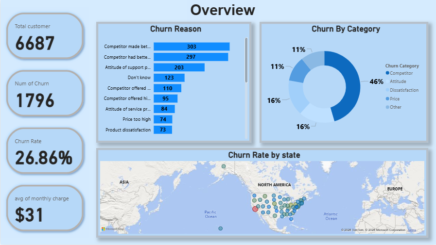
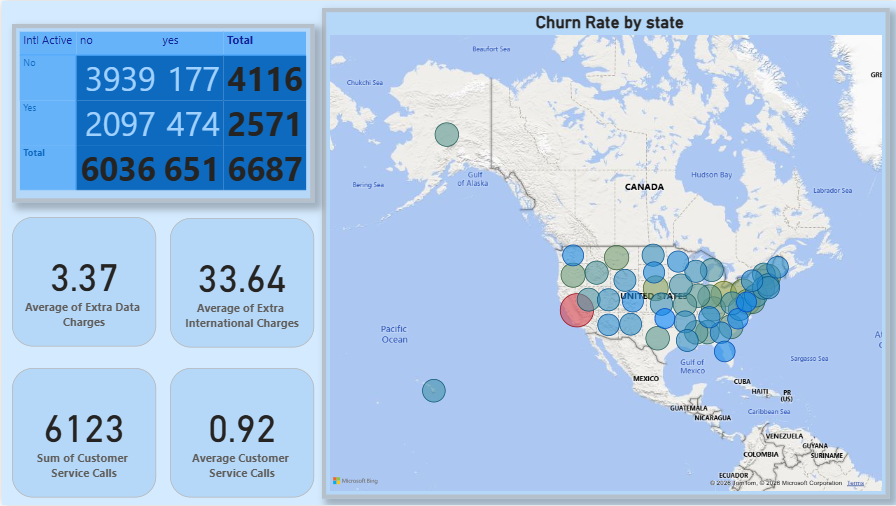
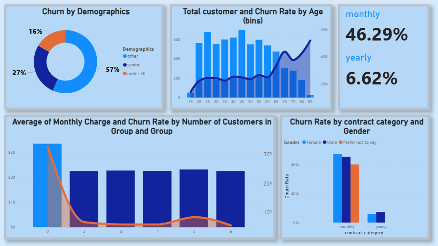
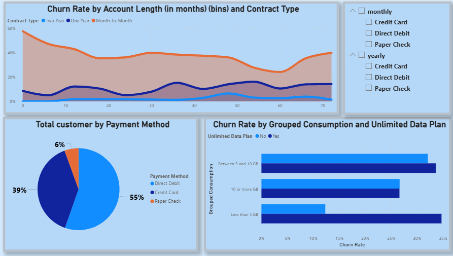

# 📊 Customer Churn Analysis Dashboard  

🚀 **Data-Driven Insights to Understand & Reduce Customer Churn**  

This project delivers a professional analysis of customer churn using interactive dashboards and visual storytelling. It helps businesses uncover why customers leave and how to improve retention strategies using data-driven insights.  

---

## 📌 Project Overview  
Customer churn is one of the most critical challenges for businesses.  
In this project, we analyze customer behavior, plans, and demographics to identify patterns that lead to churn and provide actionable insights to reduce it.  

---

## 🎯 Key Features  
- 📉 Churn Analysis – Identify main reasons behind customer loss  
- 👥 Customer Segmentation – Analyze different customer groups  
- 📊 Plan & Contract Insights – Compare churn across plans  
- 🌍 International Usage Impact – تأثير الخطط الدولية على العملاء  
- 📈 Interactive Dashboards – Clear and powerful visualizations  
- 💡 Business Insights – Recommendations based on data  

---

## 📊 Dashboards  

### 🔹 Overview Dashboard  

---

### 🔹 International Plan Dashboard  

---

### 🔹 Groups & Category Dashboard  

---

### 🔹 Contract & Plan Dashboard  

---

## 📈 Insights Highlights  
- High churn observed in **month-to-month contracts**  
- Customers with **international plans** show different behavior patterns  
- Certain **customer groups & categories** have higher churn rates  
- Service-related issues significantly impact customer retention  

---

## 🛠 Tech Stack  
- Python 🐍  
- Pandas  
- Matplotlib  
- Seaborn  
- Jupyter Notebook  

